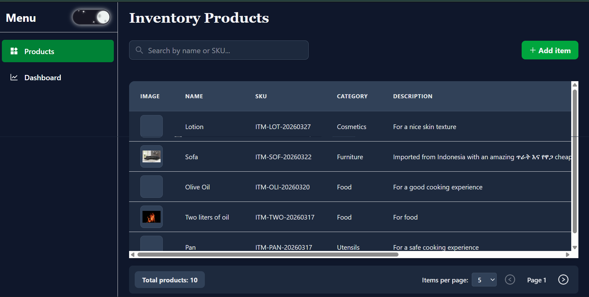
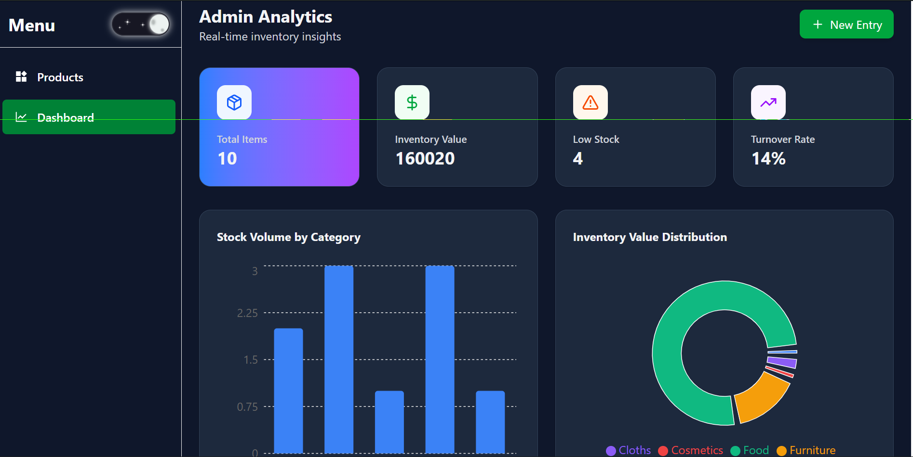
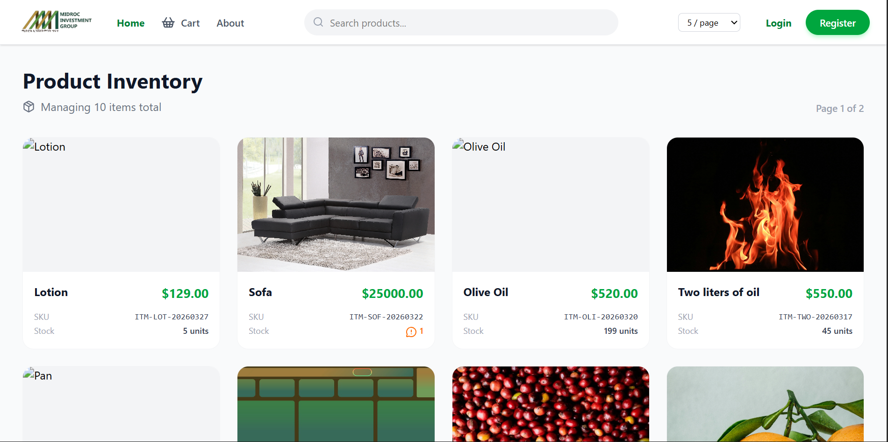
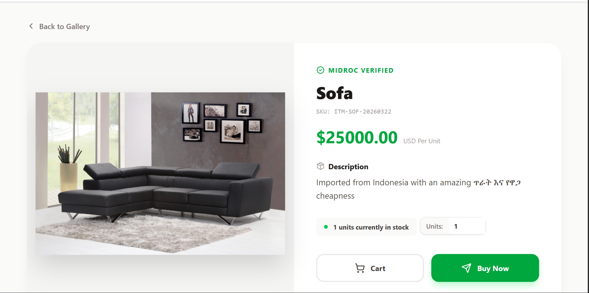
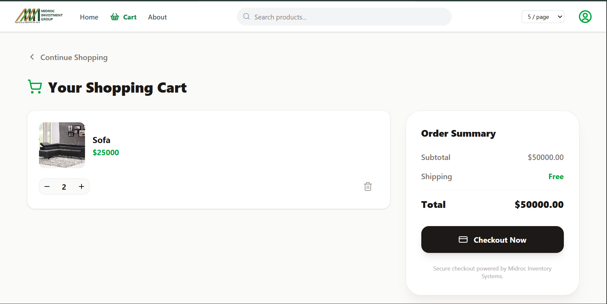

# Inventory Management System | Midroc Investment Group

A professional full-stack inventory management and e-commerce platform built for the Midroc Investment Group ecosystem. This system manages products, carts, orders, and secure payments.

## 🚀 Features

- Authentication: Custom JWT-based user management (Login/Register/Logout)
- Product Management: Full CRUD operations with category filtering and search
- Cart System: Persistent shopping cart for users
- Order & Transactions: Track purchases and order history
- Payment Integration: Secure checkout using Chapa Payment Gateway
- Responsive UI: Modern design with sticky navigation and professional footer using Tailwind CSS
- API Documentation: Swagger/OpenAPI docs via drf-spectacular

---

## 🛠️ Tech Stack

### Backend
- Django 6.0 + Django REST Framework (DRF)
- SQLite (Development) / MySQL or PostgreSQL (Production)
- SimpleJWT (Authentication)
- drf-spectacular (API Docs)
- django-cors-headers
- django-filter

### Frontend
- React (Vite)
- Tailwind CSS
- Lucide-React, React-Icons
- React Router DOM
- Axios

---

## 📂 Project Structure

### backend
- inventory (core settings)
- user_mgt (custom user model)
- products (product catalog)
- order (order processing)
- payment (Chapa integration)
- .env.example

### frontend
- src
  - assets (images & logos)
  - components (reusable UI like navbar, footer)
  - pages (main views)
- .env.example

---

## ⚙️ Installation & Setup

### Backend Setup
- Navigate to backend folder
- Create and activate virtual environment
- Install dependencies
- Configure environment variables
- Run migrations
- Start the development server

### Frontend Setup
- Navigate to frontend folder
- Install dependencies
- Configure environment variables
- Start the development server

---

## 🔐 Environment Variables

### Backend
- SECRET_KEY
- DEBUG
- DATABASE_URL
- CHAPA_SECRET_KEY

### Frontend
- VITE_API_URL

---

## 📖 API Documentation

Access Swagger/OpenAPI documentation after running the backend server.

---

## 👨‍💻 Author

Developed as part of a full-stack system for Midroc Investment Group.

## 📸 Screenshots

### Admin pages

### Customer Page

